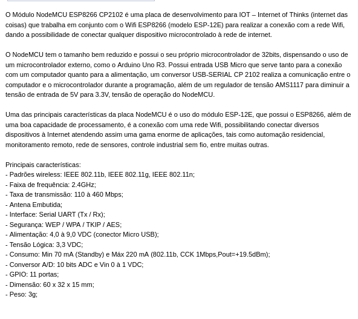

[source - Miguel Grinberg - esp8266-esp12](https://blog.miguelgrinberg.com/post/micropython-and-the-internet-of-things-part-i-welcome)




Links:
- [Quick reference Micro python fos ESP8266](https://docs.micropython.org/en/latest/esp8266/quickref.html)
- [Summary esp8266-esp12](https://www.embedded-robotics.com/programming-esp8266/)
- [micro python FY ](https://micropython.org/download/?port=esp8266)
- [espressif.com](https://www.espressif.com/en/products/modules)
- [datasheet_en.pdf](https://espressif.com/sites/default/files/documentation/0a-esp8266ex_datasheet_en.pdf)
- [micropython.org/download/esp8266](https://micropython.org/download/esp8266/)
- [Quick reference for the ESP8266](https://docs.micropython.org/en/latest/esp8266/quickref.html)
- [NODEMCUDocumentation](https://nodemcu.readthedocs.io/en/latest/flash/)
- [esptool.py at nodemcu.readthedocs.io](https://nodemcu.readthedocs.io/en/latest/getting-started/#esptoolpy)
- [Arduino IDE, also supports ESP8266 development](https://docs.arduino.cc/software/ide-v1/tutorials/Linux)

Python requirements
``` 
$ esptool.py flash_id
$ esptool.py erase_flash
```

NOTES:
 - Flash-mode is __qio__ for most ESP8266 ESP-01/07 (512 kByte modules) 
and __dio__ for most ESP32 and ESP8266 ESP-12 (>=4 MByte modules). 
ESP8285 requires dout.  
   print(node.flashsize())as      


``` 
$ dmesg
$ dmesg | grep -i serial
$ dmesg | grep -i FTDI
$ lsusb
```

Permit access to serial ports
- ``` sudo usermod -a -G dialout $USER```

Access to board info
- esptool.py flash_id
  - use this to reboot the board. oit will try to load the main.py, and also export board info
- ```
    (venv) [user@fedora ~]$ esptool.py flash_id
    esptool.py v4.1
    Found 1 serial ports
    Serial port /dev/ttyUSB0
    Connecting....
    Detecting chip type... Unsupported detection protocol, switching and trying again...
    Connecting....
    Detecting chip type... ESP8266
    Chip is ESP8266EX
    Features: WiFi
    Crystal is 26MHz
    MAC: c4:5b:be:54:b6:58
    Uploading stub...
    Running stub...
    Stub running...
    Manufacturer: d8
    Device: 4016
    Detected flash size: 4MB
    Hard resetting via RTS pin...
  ```

Erase the flash
- ```sudo esptool.py --port /dev/ttyUSB0 erase_flash```

- ```esptool.py erase_flash```


[docs.micropython.org - deploying-the-firmware](http://docs.micropython.org/en/latest/esp8266/tutorial/intro.html#deploying-the-firmware)

Flashing the board:
- ```esptool.py --port /dev/ttyUSB0 --baud 460800 write_flash -fm dio --flash_size=detect 0 esp8266-20220618-v1.19.1.bin ```

Connect via serial to the board using rshell
- ```rshell --port /dev/ttyUSB0 -b 74884 ```
- ```rshell --port /dev/ttyUSB0```
  
Access to an interactive python session
- ```repl```

this 2 files exist int the board at '/pyboard'.
- '/pyboard/boot.py     
  - this file usally is changed by the system.
- '/pyboard/main.py'    
   - Put the code here. __Our entry point to the application__

Copy a file from linux file system, to pyboard
- ``` rshell --port <board serial port name> cp main.py /pyboard ```
